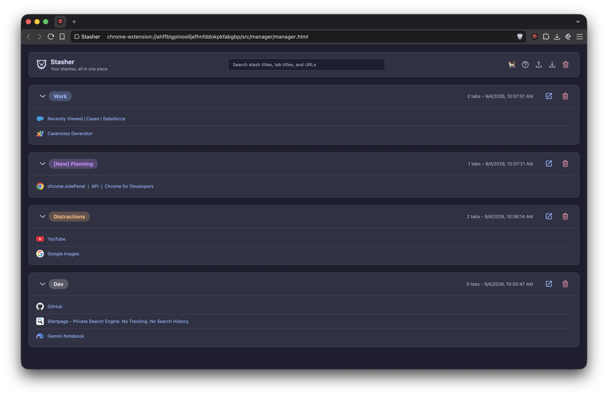

<p align="center">
  
</p>

<h1 align="center">Stasher</h1>

<p align="center">
  Your new favorite way of managing tabs! 🐈‍⬛
</p>

Stasher is a small, simple, straightforward way of managing your tabs. Allows you to "stash" them onto local disk. This saves on memory and they store safely even if your browser suddenly crashes or closes.

Just like you can stash tab groups, and tabs, you can also view, edit, or even do cleanup "crazy style". Stasher respects your space and time, and stays out of your way when you don't need it.

## Preview

<p align="center">
  
</p>

## What it does

- Store singular tabs with right-click -> `Stash this tab`
- Store tab groups in one sweep with clicking the Stasher's icon @ top right, or press **⌥**+**S**
- Keep things clean and ordered within the Stasher's manager view
- You can rename or change the metadata _(tab group color!)_ for a tabgroup
- Search stash titles, tab titles, and URLs
- Restore a whole stash or open individual tabs from it, do it your way!
- Want to copy your configuration elsewhere? Use the import/export feature
- No data leaves your device.
- Has both a dark and light theme, which syncs with your browser configuration!

When Stasher saves loose tabs, it leaves pinned tabs in place so the tab strip
keeps its usual shape.

## What it does not do

- It does not have any kind of sideBar, and does not intend to be an always-there manager.
- Stasher's search engine stays constrained within the manager. It does not allow you to use the search bar to search tabs.
- It does not require an account to use it.
- There's no AI features, and does not try to automatically modify things on your behalf to "improve it". It's your mess. You deal with it.
- It is simple on purpose, it does not permit every single configuration on earth.

The design of Stasher is simple: Stash, and unstash. Everything else is sprinkle on top.

## Installation

It's available [here!](https://chromewebstore.google.com/detail/stasher/feepkkcjmhhlmbghklpakdijphnlfjok) ( Chrome Web Store ).

## A small note about Firefox

Stasher has always been developed on Chromium based browsers. This means that Firefox is not supported.

This does not mean it is not _compatible_ however you may need some tweaking or even to port it. I'd be more than happy to accept said ports to the codebase if the need arises.

## Development

If you plan on fixing bugs or develop new features, this is your place;

The project has no runtime dependencies. Run the test suite with Bun:

```bash
bun test
```

Before releasing, test the extension in Chrome and at least one other Chromium browser such as Brave or Edge. The release workflow is documented in [GUIDE.md](.github/workflows/GUIDE.md).

## Contributing

Stasher was, and still is mostly built for myself. This means there are things that I avoided, on purpose or not.

If you think there's code or wonkiness that you'd like to try to improve, be my guest. I'd be more than happy to revise this together and build community. The only thing I ask is to please respect how I write code myself. Thanks!

## Support

If you would like to support me and my work, you can [buy me a coffee via PayPal](https://paypal.me/ivanperezf).

## Icon palette

- Red: [#ef5b5b](https://www.color-hex.com/color/ef5b5b)
- Purple: [#855bef](https://www.color-hex.com/color/855bef)
- Yellow: [#efde5b](https://www.color-hex.com/color/efde5b)
- Pink: [#ffa8a8](https://www.color-hex.com/color/ffa8a8)

Found a bug or have an idea? Please report it with enough context to reproduce the behavior.

Thanks for everything and for taking the time to test and give Stasher a try.

Much love~ ❤️🐱
